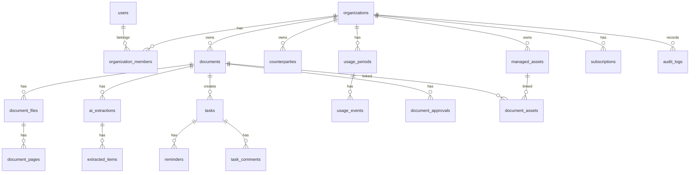

# YOMITORI DocuTask MVP機能一覧・DB設計

## 1. 前提

### サービス名

YOMITORI DocuTask

### キャッチコピー

書類を、要約・タスク・リマインド・証跡へ。

### 初期ターゲット

不動産・施設などの管理会社。

### 初期対応書類

- 行政・自治体からの通知
- 契約の更新案内
- リース契約の更新案内
- 保険の満期案内
- テナント契約の更新案内
- 法改正に伴う提出物案内

### 技術前提

- Cloudflare Workers / Pages
- Cloudflare R2
- Neon PostgreSQL
- Stripe
- OpenAI API
- Google Auth
- Google Calendar API

## 2. MVPの目的

MVPでは、書類をアップロードして AI が要約・期限抽出・タスク候補生成を行い、人間が承認してタスクと台帳に保存できる状態までを作る。

最初から目指す価値は以下。

- 書類を読む時間を短縮する
- 期限・提出物・担当者の見落としを防ぐ
- 書類と対応履歴を台帳に残す
- 月次で未処理を確認できる
- AI 抽出結果を人間が確認・承認できる

## 3. MVP機能一覧

### 3.1 認証・組織

#### 必須機能

- Google ログイン
- 初回ログイン時のユーザー作成
- 組織作成
- 組織への所属
- オーナー権限
- メンバー招待
- ログアウト

#### MVPでの簡略化

- ロールは owner / admin / member / viewer の4種類を定義する
- 初期UIでは owner / member を中心に使う
- Pro向けの細かい権限管理は後続で拡張する

#### 完了条件

- ユーザーが Google でログインできる
- 組織を作成できる
- 組織内のデータだけ閲覧できる
- 組織メンバーを招待できる

### 3.2 料金・処理上限

#### プラン

| プラン | 月額 | 月間処理件数 | 主な対象 |
|---|---:|---:|---|
| Personal | 2,980円 | 50件 | 個人・フリーランス |
| Business | 9,800円 | 300件 | 小規模管理会社 |
| Pro | 19,800円 | 500件 | 管理会社・複数拠点 |
| Enterprise | 49,800円から | 1,000件 | 施設運営・多店舗 |

#### 追加オプション

- 追加10件パック: 980円
- 追加30件パック: 1,500円

#### 必須機能

- Stripe Checkout
- Stripe Customer 作成
- サブスクリプション状態の保存
- 月間処理件数のカウント
- 処理上限到達時のブロック
- 追加パック購入
- 追加件数の消費

#### 使用件数の定義

1件 = ユーザーが登録し、AI処理を開始した1つの業務書類。

原則として、複数ページPDFでも1つの業務書類として登録されていれば1件と数える。ただし極端にページ数が多いファイルは、利用規約または上位プランで制限する。

#### 完了条件

- プランごとの月間上限を超えると新規AI処理を開始できない
- 追加パック購入後、処理可能件数が増える
- 使用履歴が管理画面で確認できる

### 3.3 管理対象・取引先

管理会社向けに、物件・施設・テナント・取引先の紐づけをMVPから用意する。

#### 必須機能

- 管理対象の作成
- 管理対象の種別
- 取引先の作成
- 書類への管理対象紐づけ
- 書類への取引先紐づけ

#### 管理対象の例

- 物件
- 施設
- 店舗
- テナント
- 拠点

#### 取引先の例

- 自治体
- 消防設備会社
- 保険会社
- リース会社
- テナント
- オーナー
- 管理委託先

#### MVPでの簡略化

- 管理対象は階層構造を持てる設計にするが、初期UIでは1階層でもよい
- 取引先の詳細項目は最小限にする

### 3.4 書類登録

#### 必須機能

- PDFアップロード
- 画像アップロード
- テキスト貼り付け
- メール本文貼り付け
- 書類タイトル入力
- 書類種別の手動選択
- 管理対象の選択
- 取引先の選択
- 登録後の処理ステータス表示

#### 初期対応形式

- PDF
- PNG
- JPEG
- プレーンテキスト

#### MVPでの簡略化

- メール自動取り込みは後続
- 複数ファイルを1書類としてまとめる機能は後続でもよい
- ページ順のAI並び替えは初期では候補表示まで

#### 完了条件

- 書類を登録できる
- R2に原本ファイルが保存される
- DBに書類メタデータが保存される
- AI処理ジョブが開始される

### 3.5 OCR・テキスト化

#### 必須機能

- PDF / 画像からテキスト抽出
- ページごとのOCR結果保存
- OCR失敗時のエラー表示
- テキスト貼り付け時はOCRをスキップ

#### オムニスキャン由来の処理

- 傾き補正
- 天地判定
- ページ単位の認識
- OCR前処理

#### MVPでの簡略化

- 高度な書類分割は後続
- ページ順の完全自動確定は後続
- 初期は「人間が確認できる状態」を優先する

### 3.6 AI抽出

#### 必須機能

- 書類種別の推定
- 書類概要の生成
- 本文要約
- 期限抽出
- 提出物抽出
- やること抽出
- 注意点抽出
- 担当者候補
- タスク候補生成
- リマインド候補生成
- 保管名候補生成
- 抽出根拠テキストの保存
- confidence の保存

#### 行政・自治体通知で抽出する項目

- 発行元
- 書類名
- 対象施設・対象物件
- 通知日
- 対応期限
- 申請期限
- 提出物
- 必要な対応
- 対応しない場合のリスク
- 問い合わせ先
- 担当部署候補

#### 契約更新案内で抽出する項目

- 契約名
- 契約相手
- 対象物件・施設・テナント
- 現契約期間
- 更新後期間
- 更新期限
- 解約申出期限
- 金額
- 条件変更
- 必要な対応
- 注意点
- 担当者候補

#### 完了条件

- AI抽出結果が構造化データとして保存される
- 抽出結果を承認画面で編集できる
- 元書類の該当箇所を確認できる

### 3.7 AI抽出確認・承認画面

#### 画面構成

左右2ペイン構造。

左ペイン:

- PDF / 画像原本プレビュー
- ページ切り替え
- 拡大・縮小
- OCRテキスト確認
- AIが参照した箇所のハイライト

右ペイン:

- 書類概要
- 要約
- やること
- 期限
- 提出物
- 担当者
- 取引先
- 管理対象
- 注意点
- リマインド
- タスク候補
- 承認ボタン
- 修正保存
- 再解析

#### 必須機能

- AI抽出結果の編集
- タスク候補の追加・削除
- 担当者の選択
- 期限の変更
- リマインド日の変更
- 承認
- 差し戻し
- 再解析

#### 重要方針

AI抽出結果は自動確定しない。ユーザーが承認した時点で、台帳・タスク・通知に正式反映する。

#### 完了条件

- 原本と抽出結果を見比べながら承認できる
- 承認後にタスクと台帳が作成・更新される
- 承認者と承認日時が記録される

### 3.8 タスク管理

#### 必須機能

- AI抽出結果からタスク作成
- 手動タスク作成
- 担当者設定
- 期限設定
- 優先度設定
- ステータス変更
- コメント
- 完了処理
- 関連書類へのリンク

#### ステータス

- 未着手
- 対応中
- 確認待ち
- 完了
- 不要

#### 完了条件

- 書類からタスクを作れる
- タスク一覧で担当者・期限・状態を確認できる
- タスク完了時に履歴が残る

### 3.9 リマインド・通知

#### 必須機能

- 期限前リマインド
- 担当者割当通知
- 承認待ち通知
- 期限超過通知
- 通知履歴の保存

#### 初期通知チャネル

- アプリ内通知
- メール通知

#### 後続候補

- Google Calendar
- Slack
- Teams
- LINE WORKS

#### Google Calendar連携

Personalの価値としてカレンダー連携を訴求するため、MVPでは最低限以下を検討する。

- タスク期限をGoogle Calendarに登録
- カレンダーイベントURLを保存
- タスク完了時にイベントを更新または削除

実装負荷が高い場合、MVP初期では .ics ダウンロードから開始してもよい。

### 3.10 書類台帳

#### 必須機能

- 書類一覧
- 書類詳細
- 書類種別
- 管理対象
- 取引先
- 担当者
- 期限
- ステータス
- 関連タスク
- AI要約
- 承認履歴
- 原本ファイルリンク

#### フィルター

- 書類種別
- 管理対象
- 取引先
- 担当者
- ステータス
- 期限
- 承認状態

#### 完了条件

- 書類を後から検索・確認できる
- 対応状況と関連タスクが分かる
- 誰が承認したか分かる

### 3.11 月次未処理一覧

#### 必須機能

- 月別の未処理書類一覧
- 期限超過
- 期限間近
- 担当者未設定
- 承認待ち
- 未完了タスク
- 該当書類へのリンク
- 該当タスクへのリンク

#### MVPでの簡略化

- CSV / PDF 出力は後続でもよい
- 初期は画面上の一覧表示を優先する

#### 完了条件

- 未処理一覧から、該当書類とタスク画面へワンクリックで遷移できる

### 3.12 監査ログ

#### MVPで記録する操作

- 書類登録
- AI処理開始
- AI抽出結果の修正
- 承認
- タスク作成
- タスク担当者変更
- タスク期限変更
- タスク完了
- 書類削除
- メンバー招待
- 権限変更

#### MVPでの簡略化

- 監査ログの閲覧UIはPro以降でもよい
- DBには最初から記録する

### 3.13 管理画面・設定

#### 必須機能

- 組織設定
- メンバー管理
- 管理対象管理
- 取引先管理
- 通知設定
- 使用件数確認
- プラン確認

#### 後続候補

- 書類分類テンプレート
- 台帳項目カスタム
- API / Webhook
- 権限詳細設定

## 4. MVP対象外

初期リリースでは、以下は後続に回す。

- 士業向け高度セキュリティ
- 複雑な承認ワークフロー
- 複数段階承認
- メール自動受信
- Slack / Teams 通知
- 高度な差分比較
- API / Webhook
- 顧客別ポータル
- AIによる法務・税務判断
- 完全自動の書類確定
- 請求書・見積書の経理処理特化機能

## 5. 主要ワークフロー

### 5.1 書類登録からタスク作成まで

1. ユーザーが書類をアップロード
2. 書類メタデータを保存
3. 使用件数を確認
4. 使用可能ならAI処理ジョブを開始
5. 原本をR2に保存
6. OCR / テキスト化
7. AIが構造化抽出
8. 抽出結果を保存
9. ステータスを承認待ちにする
10. ユーザーが承認画面で確認
11. 必要に応じて修正
12. 承認
13. タスク作成
14. リマインド作成
15. 台帳に反映
16. 監査ログ記録

### 5.2 月次未処理確認

1. ユーザーが月次未処理一覧を開く
2. 承認待ち書類を確認
3. 期限超過タスクを確認
4. 担当者未設定タスクを確認
5. 一覧から該当書類へ移動
6. 承認または修正
7. 一覧から該当タスクへ移動
8. 担当者設定または完了処理

### 5.3 追加パック購入

1. 使用上限に近づく
2. 管理画面に残数警告を表示
3. 追加10件または30件パックを選択
4. Stripe Checkout
5. Webhookで購入を反映
6. 追加件数を利用可能にする

## 6. DB設計方針

### 基本方針

- Neon PostgreSQL を前提にする
- 主キーは UUID
- 日時は timestamptz
- 組織スコープのテーブルには organization_id を必ず持たせる
- R2上のファイルは公開URLではなく storage_key で保存する
- ファイル閲覧は署名付きURLで行う
- AIの生出力は jsonb で保存する
- 人間が承認した値は通常カラムに正規化して保存する
- 監査ログは追記専用にする
- 削除は原則 soft delete を使う

### 命名方針

- テーブル名は複数形
- 主キーは id
- 外部キーは `{table単数}_id`
- 作成日時は created_at
- 更新日時は updated_at
- 論理削除は deleted_at

## 7. ER概要

## 8. Enum定義

### plan_code

- personal
- business
- pro
- enterprise

### member_role

- owner
- admin
- member
- viewer

### asset_type

- property
- facility
- store
- tenant
- office
- other

### counterparty_type

- municipality
- tenant
- owner
- vendor
- insurer
- leasing_company
- maintenance_company
- other

### document_source_type

- pdf
- image
- text
- email_paste

### document_type

- municipal_notice
- contract_renewal
- lease_renewal
- insurance_renewal
- tenant_contract_renewal
- legal_change_notice
- inspection_report
- other

### document_status

- draft
- uploaded
- processing
- needs_review
- approved
- action_required
- completed
- archived
- failed

### extraction_status

- pending
- processing
- succeeded
- failed
- superseded

### extracted_item_type

- summary
- due_date
- required_action
- required_document
- amount
- counterparty
- contact
- risk
- task
- reminder
- contract_period
- cancellation_deadline
- other

### task_status

- todo
- in_progress
- waiting_review
- done
- unnecessary
- canceled

### task_priority

- low
- normal
- high
- urgent

### reminder_status

- scheduled
- sent
- canceled
- failed

### notification_channel

- in_app
- email
- google_calendar

## 9. テーブル設計

### 9.1 organizations

組織。

| カラム | 型 | 必須 | 説明 |
|---|---|---:|---|
| id | uuid | yes | PK |
| name | text | yes | 組織名 |
| plan_code | plan_code | yes | 現在プラン |
| billing_email | text | no | 請求先メール |
| stripe_customer_id | text | no | Stripe顧客ID |
| default_timezone | text | yes | 初期値 Asia/Tokyo |
| created_at | timestamptz | yes | 作成日時 |
| updated_at | timestamptz | yes | 更新日時 |
| deleted_at | timestamptz | no | 論理削除 |

主要index:

- unique(stripe_customer_id)

### 9.2 users

ユーザー本体。複数組織所属を考慮し、組織との関係は organization_members に分ける。

| カラム | 型 | 必須 | 説明 |
|---|---|---:|---|
| id | uuid | yes | PK |
| email | citext | yes | メール |
| name | text | no | 表示名 |
| avatar_url | text | no | アイコン |
| auth_provider | text | yes | google |
| auth_provider_subject | text | yes | Google sub |
| last_login_at | timestamptz | no | 最終ログイン |
| created_at | timestamptz | yes | 作成日時 |
| updated_at | timestamptz | yes | 更新日時 |
| deleted_at | timestamptz | no | 論理削除 |

主要index:

- unique(email)
- unique(auth_provider, auth_provider_subject)

### 9.3 organization_members

組織メンバー。

| カラム | 型 | 必須 | 説明 |
|---|---|---:|---|
| id | uuid | yes | PK |
| organization_id | uuid | yes | FK |
| user_id | uuid | yes | FK |
| role | member_role | yes | 権限 |
| invited_by | uuid | no | 招待者user_id |
| joined_at | timestamptz | no | 参加日時 |
| created_at | timestamptz | yes | 作成日時 |
| updated_at | timestamptz | yes | 更新日時 |
| deleted_at | timestamptz | no | 論理削除 |

主要index:

- unique(organization_id, user_id)
- index(organization_id, role)

### 9.4 member_invitations

招待。

| カラム | 型 | 必須 | 説明 |
|---|---|---:|---|
| id | uuid | yes | PK |
| organization_id | uuid | yes | FK |
| email | citext | yes | 招待先 |
| role | member_role | yes | 招待権限 |
| token_hash | text | yes | 招待トークンのハッシュ |
| invited_by | uuid | yes | user_id |
| accepted_at | timestamptz | no | 承認日時 |
| expires_at | timestamptz | yes | 期限 |
| created_at | timestamptz | yes | 作成日時 |

主要index:

- index(organization_id, email)
- unique(token_hash)

### 9.5 managed_assets

管理対象。物件・施設・店舗・テナントなど。

| カラム | 型 | 必須 | 説明 |
|---|---|---:|---|
| id | uuid | yes | PK |
| organization_id | uuid | yes | FK |
| parent_id | uuid | no | 階層化用 |
| asset_type | asset_type | yes | 種別 |
| name | text | yes | 名称 |
| code | text | no | 管理コード |
| address | text | no | 住所 |
| memo | text | no | メモ |
| created_at | timestamptz | yes | 作成日時 |
| updated_at | timestamptz | yes | 更新日時 |
| deleted_at | timestamptz | no | 論理削除 |

主要index:

- index(organization_id, asset_type)
- index(organization_id, name)

### 9.6 counterparties

取引先・発行元・契約相手。

| カラム | 型 | 必須 | 説明 |
|---|---|---:|---|
| id | uuid | yes | PK |
| organization_id | uuid | yes | FK |
| counterparty_type | counterparty_type | yes | 種別 |
| name | text | yes | 名称 |
| contact_name | text | no | 担当者名 |
| email | text | no | メール |
| phone | text | no | 電話 |
| address | text | no | 住所 |
| memo | text | no | メモ |
| created_at | timestamptz | yes | 作成日時 |
| updated_at | timestamptz | yes | 更新日時 |
| deleted_at | timestamptz | no | 論理削除 |

主要index:

- index(organization_id, counterparty_type)
- index(organization_id, name)

### 9.7 documents

書類台帳の中心テーブル。AI出力のうち、人間が承認した主要値をここに保存する。

| カラム | 型 | 必須 | 説明 |
|---|---|---:|---|
| id | uuid | yes | PK |
| organization_id | uuid | yes | FK |
| created_by_member_id | uuid | yes | 登録者 |
| counterparty_id | uuid | no | 取引先 |
| title | text | yes | 書類タイトル |
| suggested_title | text | no | AI保管名候補 |
| document_type | document_type | yes | 書類種別 |
| source_type | document_source_type | yes | 登録元 |
| status | document_status | yes | 処理状態 |
| document_date | date | no | 書類日付 |
| due_date | date | no | 主期限 |
| summary | text | no | 承認済み要約 |
| key_points | jsonb | no | 重要事項 |
| required_actions | jsonb | no | 必要対応 |
| required_documents | jsonb | no | 提出物 |
| risks | jsonb | no | 注意点・リスク |
| approved_at | timestamptz | no | 承認日時 |
| approved_by_member_id | uuid | no | 承認者 |
| completed_at | timestamptz | no | 完了日時 |
| archived_at | timestamptz | no | アーカイブ日時 |
| created_at | timestamptz | yes | 作成日時 |
| updated_at | timestamptz | yes | 更新日時 |
| deleted_at | timestamptz | no | 論理削除 |

主要index:

- index(organization_id, status)
- index(organization_id, document_type)
- index(organization_id, due_date)
- index(organization_id, counterparty_id)
- index(organization_id, created_at)

### 9.8 document_assets

書類と管理対象の多対多。複数物件にまたがる通知に対応する。

| カラム | 型 | 必須 | 説明 |
|---|---|---:|---|
| id | uuid | yes | PK |
| document_id | uuid | yes | FK |
| managed_asset_id | uuid | yes | FK |
| created_at | timestamptz | yes | 作成日時 |

主要index:

- unique(document_id, managed_asset_id)
- index(managed_asset_id)

### 9.9 document_files

R2に保存した原本・派生ファイル。

| カラム | 型 | 必須 | 説明 |
|---|---|---:|---|
| id | uuid | yes | PK |
| organization_id | uuid | yes | FK |
| document_id | uuid | yes | FK |
| file_role | text | yes | original / processed / preview |
| original_filename | text | no | 元ファイル名 |
| mime_type | text | yes | MIME |
| storage_key | text | yes | R2 key |
| size_bytes | bigint | no | サイズ |
| page_count | integer | no | ページ数 |
| sha256 | text | no | 重複検知用 |
| created_at | timestamptz | yes | 作成日時 |
| deleted_at | timestamptz | no | 論理削除 |

主要index:

- index(organization_id, document_id)
- unique(storage_key)
- index(sha256)

### 9.10 document_pages

ページ単位のOCR・プレビュー管理。

| カラム | 型 | 必須 | 説明 |
|---|---|---:|---|
| id | uuid | yes | PK |
| document_file_id | uuid | yes | FK |
| document_id | uuid | yes | FK |
| page_number | integer | yes | 1始まり |
| preview_storage_key | text | no | ページ画像 |
| width | integer | no | 幅 |
| height | integer | no | 高さ |
| rotation_degrees | integer | no | 補正角度 |
| ocr_text | text | no | OCR結果 |
| ocr_confidence | numeric | no | OCR信頼度 |
| created_at | timestamptz | yes | 作成日時 |
| updated_at | timestamptz | yes | 更新日時 |

主要index:

- unique(document_file_id, page_number)
- index(document_id, page_number)

### 9.11 processing_jobs

OCRやAI処理のジョブ。

| カラム | 型 | 必須 | 説明 |
|---|---|---:|---|
| id | uuid | yes | PK |
| organization_id | uuid | yes | FK |
| document_id | uuid | yes | FK |
| job_type | text | yes | ocr / ai_extract / calendar_sync |
| status | text | yes | queued / running / succeeded / failed |
| attempt_count | integer | yes | 試行回数 |
| error_message | text | no | エラー |
| started_at | timestamptz | no | 開始日時 |
| finished_at | timestamptz | no | 終了日時 |
| created_at | timestamptz | yes | 作成日時 |
| updated_at | timestamptz | yes | 更新日時 |

主要index:

- index(status, created_at)
- index(organization_id, document_id)

### 9.12 ai_extractions

AI抽出の実行単位。再解析があるため複数世代を持つ。

| カラム | 型 | 必須 | 説明 |
|---|---|---:|---|
| id | uuid | yes | PK |
| organization_id | uuid | yes | FK |
| document_id | uuid | yes | FK |
| status | extraction_status | yes | 状態 |
| model | text | yes | 使用モデル |
| prompt_version | text | yes | プロンプト版 |
| input_text_hash | text | no | 入力テキストhash |
| raw_output | jsonb | no | AI生出力 |
| normalized_output | jsonb | no | 正規化結果 |
| overall_confidence | numeric | no | 全体信頼度 |
| created_by_member_id | uuid | no | 実行者 |
| created_at | timestamptz | yes | 作成日時 |
| completed_at | timestamptz | no | 完了日時 |

主要index:

- index(organization_id, document_id)
- index(document_id, created_at desc)

### 9.13 extracted_items

AIが抽出した個別項目。承認前の候補。

| カラム | 型 | 必須 | 説明 |
|---|---|---:|---|
| id | uuid | yes | PK |
| organization_id | uuid | yes | FK |
| extraction_id | uuid | yes | FK |
| document_id | uuid | yes | FK |
| item_type | extracted_item_type | yes | 種別 |
| label | text | yes | 表示名 |
| value_text | text | no | 文字列値 |
| value_date | date | no | 日付値 |
| value_amount | numeric | no | 金額 |
| value_json | jsonb | no | その他構造値 |
| confidence | numeric | no | 信頼度 |
| source_text | text | no | 根拠文 |
| page_number | integer | no | 根拠ページ |
| bounding_box | jsonb | no | ハイライト用 |
| user_edited | boolean | yes | ユーザー編集済み |
| accepted | boolean | no | 採用可否 |
| created_at | timestamptz | yes | 作成日時 |
| updated_at | timestamptz | yes | 更新日時 |

主要index:

- index(document_id, item_type)
- index(extraction_id)

### 9.14 document_approvals

承認履歴。再承認に備えて履歴として持つ。

| カラム | 型 | 必須 | 説明 |
|---|---|---:|---|
| id | uuid | yes | PK |
| organization_id | uuid | yes | FK |
| document_id | uuid | yes | FK |
| extraction_id | uuid | no | 承認元AI抽出 |
| approved_by_member_id | uuid | yes | 承認者 |
| approval_status | text | yes | approved / rejected |
| comment | text | no | コメント |
| approved_snapshot | jsonb | yes | 承認時点の内容 |
| created_at | timestamptz | yes | 作成日時 |

主要index:

- index(organization_id, document_id)
- index(approved_by_member_id, created_at)

### 9.15 tasks

タスク。

| カラム | 型 | 必須 | 説明 |
|---|---|---:|---|
| id | uuid | yes | PK |
| organization_id | uuid | yes | FK |
| document_id | uuid | no | 関連書類 |
| source_extracted_item_id | uuid | no | 元AI抽出項目 |
| title | text | yes | タスク名 |
| description | text | no | 詳細 |
| assignee_member_id | uuid | no | 担当者 |
| created_by_member_id | uuid | yes | 作成者 |
| due_date | date | no | 期限 |
| priority | task_priority | yes | 優先度 |
| status | task_status | yes | 状態 |
| completed_at | timestamptz | no | 完了日時 |
| completed_by_member_id | uuid | no | 完了者 |
| created_at | timestamptz | yes | 作成日時 |
| updated_at | timestamptz | yes | 更新日時 |
| deleted_at | timestamptz | no | 論理削除 |

主要index:

- index(organization_id, status)
- index(organization_id, due_date)
- index(organization_id, assignee_member_id)
- index(document_id)

### 9.16 task_comments

タスクコメント。

| カラム | 型 | 必須 | 説明 |
|---|---|---:|---|
| id | uuid | yes | PK |
| organization_id | uuid | yes | FK |
| task_id | uuid | yes | FK |
| member_id | uuid | yes | 投稿者 |
| body | text | yes | 本文 |
| created_at | timestamptz | yes | 作成日時 |
| updated_at | timestamptz | yes | 更新日時 |
| deleted_at | timestamptz | no | 論理削除 |

主要index:

- index(task_id, created_at)

### 9.17 reminders

リマインド。

| カラム | 型 | 必須 | 説明 |
|---|---|---:|---|
| id | uuid | yes | PK |
| organization_id | uuid | yes | FK |
| task_id | uuid | yes | FK |
| recipient_member_id | uuid | yes | 通知先 |
| channel | notification_channel | yes | 通知種別 |
| remind_at | timestamptz | yes | 通知日時 |
| status | reminder_status | yes | 状態 |
| sent_at | timestamptz | no | 送信日時 |
| error_message | text | no | エラー |
| created_at | timestamptz | yes | 作成日時 |
| updated_at | timestamptz | yes | 更新日時 |

主要index:

- index(status, remind_at)
- index(organization_id, task_id)
- index(recipient_member_id, remind_at)

### 9.18 notifications

アプリ内通知とメール送信履歴。

| カラム | 型 | 必須 | 説明 |
|---|---|---:|---|
| id | uuid | yes | PK |
| organization_id | uuid | yes | FK |
| recipient_member_id | uuid | yes | 通知先 |
| notification_type | text | yes | 種別 |
| title | text | yes | タイトル |
| body | text | no | 本文 |
| target_type | text | no | document / task |
| target_id | uuid | no | 遷移先 |
| read_at | timestamptz | no | 既読日時 |
| created_at | timestamptz | yes | 作成日時 |

主要index:

- index(recipient_member_id, read_at, created_at desc)
- index(organization_id, created_at desc)

### 9.19 subscriptions

Stripeサブスクリプション。

| カラム | 型 | 必須 | 説明 |
|---|---|---:|---|
| id | uuid | yes | PK |
| organization_id | uuid | yes | FK |
| stripe_subscription_id | text | no | Stripe subscription |
| stripe_customer_id | text | yes | Stripe customer |
| plan_code | plan_code | yes | プラン |
| status | text | yes | active / trialing / past_due / canceled |
| current_period_start | timestamptz | no | 期間開始 |
| current_period_end | timestamptz | no | 期間終了 |
| cancel_at_period_end | boolean | yes | 期間終了解約 |
| created_at | timestamptz | yes | 作成日時 |
| updated_at | timestamptz | yes | 更新日時 |

主要index:

- unique(stripe_subscription_id)
- index(organization_id, status)

### 9.20 usage_periods

月間使用枠。

| カラム | 型 | 必須 | 説明 |
|---|---|---:|---|
| id | uuid | yes | PK |
| organization_id | uuid | yes | FK |
| period_start | date | yes | 対象期間開始 |
| period_end | date | yes | 対象期間終了 |
| included_count | integer | yes | プラン内件数 |
| purchased_extra_count | integer | yes | 追加購入件数 |
| used_count | integer | yes | 使用件数 |
| created_at | timestamptz | yes | 作成日時 |
| updated_at | timestamptz | yes | 更新日時 |

主要index:

- unique(organization_id, period_start, period_end)

### 9.21 usage_events

使用履歴。消費・返却・追加購入を記録する。

| カラム | 型 | 必須 | 説明 |
|---|---|---:|---|
| id | uuid | yes | PK |
| organization_id | uuid | yes | FK |
| usage_period_id | uuid | yes | FK |
| document_id | uuid | no | 関連書類 |
| event_type | text | yes | consume / refund / purchase_extra |
| quantity | integer | yes | 数量 |
| reason | text | no | 理由 |
| stripe_payment_intent_id | text | no | 追加購入決済ID |
| created_by_member_id | uuid | no | 実行者 |
| created_at | timestamptz | yes | 作成日時 |

主要index:

- index(organization_id, created_at)
- index(usage_period_id)
- index(document_id)

### 9.22 extra_packs

追加パック購入。

| カラム | 型 | 必須 | 説明 |
|---|---|---:|---|
| id | uuid | yes | PK |
| organization_id | uuid | yes | FK |
| usage_period_id | uuid | yes | FK |
| pack_code | text | yes | extra_10 / extra_30 |
| purchased_count | integer | yes | 購入件数 |
| price_yen | integer | yes | 価格 |
| stripe_checkout_session_id | text | no | Checkout |
| stripe_payment_intent_id | text | no | Payment |
| purchased_at | timestamptz | yes | 購入日時 |

主要index:

- index(organization_id, purchased_at)
- unique(stripe_checkout_session_id)

### 9.23 calendar_connections

Google Calendar連携。MVPで.icsから始める場合は後続でもよい。

| カラム | 型 | 必須 | 説明 |
|---|---|---:|---|
| id | uuid | yes | PK |
| organization_id | uuid | yes | FK |
| member_id | uuid | yes | 連携者 |
| provider | text | yes | google |
| encrypted_access_token | text | yes | 暗号化token |
| encrypted_refresh_token | text | no | 暗号化refresh token |
| calendar_id | text | no | カレンダーID |
| expires_at | timestamptz | no | token期限 |
| created_at | timestamptz | yes | 作成日時 |
| updated_at | timestamptz | yes | 更新日時 |
| deleted_at | timestamptz | no | 論理削除 |

主要index:

- unique(member_id, provider)

### 9.24 task_calendar_events

タスクとカレンダーイベントの対応。

| カラム | 型 | 必須 | 説明 |
|---|---|---:|---|
| id | uuid | yes | PK |
| organization_id | uuid | yes | FK |
| task_id | uuid | yes | FK |
| calendar_connection_id | uuid | yes | FK |
| provider_event_id | text | yes | Google event id |
| event_url | text | no | イベントURL |
| last_synced_at | timestamptz | no | 最終同期 |
| created_at | timestamptz | yes | 作成日時 |
| updated_at | timestamptz | yes | 更新日時 |

主要index:

- unique(calendar_connection_id, provider_event_id)
- index(task_id)

### 9.25 audit_logs

監査ログ。追記専用。

| カラム | 型 | 必須 | 説明 |
|---|---|---:|---|
| id | uuid | yes | PK |
| organization_id | uuid | yes | FK |
| actor_member_id | uuid | no | 実行者 |
| action | text | yes | 操作 |
| target_type | text | yes | document / task / member |
| target_id | uuid | no | 対象ID |
| before_json | jsonb | no | 変更前 |
| after_json | jsonb | no | 変更後 |
| ip_address | inet | no | IP |
| user_agent | text | no | UA |
| created_at | timestamptz | yes | 作成日時 |

主要index:

- index(organization_id, created_at desc)
- index(organization_id, target_type, target_id)
- index(actor_member_id, created_at desc)

## 10. 主要クエリ設計

### ダッシュボード

取得するもの:

- 今日期限のタスク
- 今週期限のタスク
- 期限超過タスク
- 承認待ち書類
- 担当者未設定タスク
- 使用件数

主要条件:

- organization_id
- tasks.status != done
- tasks.deleted_at is null
- documents.deleted_at is null

### 書類台帳

フィルター:

- document_type
- status
- due_date range
- counterparty_id
- managed_asset_id
- approved_by_member_id

document_assets 経由で管理対象検索を行う。

### 月次未処理一覧

条件:

- documents.status in (needs_review, action_required, approved)
- tasks.status in (todo, in_progress, waiting_review)
- due_date が対象月内または期限超過
- assignee_member_id is null

未処理一覧は、documents と tasks を別々に集計し、画面上で「書類起点」「タスク起点」に分けると分かりやすい。

## 11. API設計メモ

詳細なAPI設計は次工程で行うが、MVPでは以下のエンドポイント群が必要。

### Auth / Organization

- GET /me
- POST /organizations
- GET /organizations/current
- POST /organizations/current/invitations
- GET /organizations/current/members
- PATCH /organizations/current/members/:id

### Assets / Counterparties

- GET /managed-assets
- POST /managed-assets
- PATCH /managed-assets/:id
- GET /counterparties
- POST /counterparties
- PATCH /counterparties/:id

### Documents

- GET /documents
- POST /documents
- GET /documents/:id
- PATCH /documents/:id
- POST /documents/:id/files
- POST /documents/:id/process
- GET /documents/:id/extractions/latest
- POST /documents/:id/approve
- POST /documents/:id/reprocess

### Tasks

- GET /tasks
- POST /tasks
- GET /tasks/:id
- PATCH /tasks/:id
- POST /tasks/:id/comments
- POST /tasks/:id/complete

### Reminders / Notifications

- GET /notifications
- PATCH /notifications/:id/read
- POST /tasks/:id/reminders
- PATCH /reminders/:id

### Billing / Usage

- GET /billing/subscription
- POST /billing/checkout
- POST /billing/extra-pack-checkout
- GET /billing/usage
- POST /stripe/webhook

## 12. MVP実装順

### Step 1: 基盤

- 認証
- 組織
- メンバー
- R2保存
- Neon接続

### Step 2: 書類登録

- PDF / 画像 / テキスト登録
- document / document_files 保存
- 処理ステータス

### Step 3: OCR・AI抽出

- OCR
- AI構造化抽出
- ai_extractions / extracted_items 保存
- エラー処理

### Step 4: 承認画面

- 左右2ペイン
- 原本プレビュー
- 抽出結果フォーム
- 修正保存
- 承認

### Step 5: タスク・リマインド

- タスク作成
- 担当者割当
- 期限管理
- リマインド
- 通知

### Step 6: 台帳・月次未処理

- 書類台帳
- タスク一覧
- 月次未処理一覧
- ダッシュボード

### Step 7: 課金

- Stripeプラン
- 使用件数
- 上限チェック
- 追加パック

## 13. 未確定論点

### 1件の上限ページ数

料金を件数に統一したため、1件あたりの最大ページ数は決める必要がある。

初期案:

- 通常: 1件あたり20ページまで
- 20ページ超: Pro以上または追加消費
- Enterprise: 要相談

### Google Calendar連携のMVP範囲

選択肢:

- MVPからGoogle Calendar API連携
- 初期は.icsダウンロード
- Business以上からAPI連携

### 監査ログUIの扱い

DBにはMVPから保存する。UIとして見せるのはPro以降でもよい。

### 書類種別テンプレート

初期は固定テンプレートでよい。将来的には管理会社ごとにカスタムテンプレートを作れるようにする。

### 差分比較

Proの価値になるため、MVPではDB構造を邪魔しない程度に留める。契約更新案内では、過去書類との比較候補を後から追加できるよう document_type / counterparty / managed_asset を必ず保存する。

## 14. 次に作るべきもの

1. 画面一覧・画面遷移図
2. 承認画面の詳細UI仕様
3. AI抽出JSONスキーマ
4. API詳細仕様
5. Neon用DDL
6. MVP実装タスク分解
